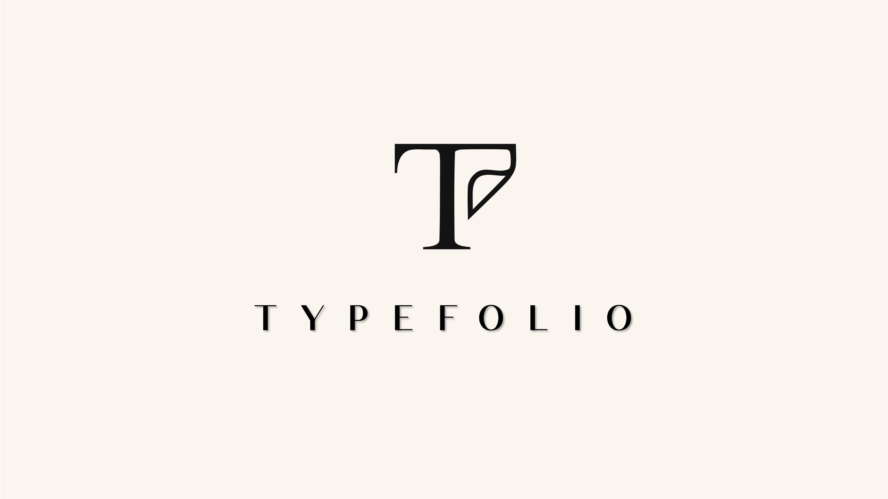

# Typefolio



Typefolio is a typography-first personal website starter built with [Astro](https://astro.build/), designed for researchers and developers who value clarity, elegance, and focus. Its name comes from type and folio, reflecting a professional, minimal, and academic-minded approach to presenting writing, projects, and ideas. Guided by the principle of Occam's razor, Typefolio keeps only the elements that matter most, delivering a clean reading experience and the most essential features for serious personal publishing.

## Table Of Contents

- [Typefolio](#typefolio)
  - [Table Of Contents](#table-of-contents)
  - [Key Features](#key-features)
  - [Demo 💻](#demo-)
  - [Quick Start](#quick-start)
    - [Deploy to Online Hosting](#deploy-to-online-hosting)
    - [Clone the Template](#clone-the-template)
    - [Fork the Template](#fork-the-template)
    - [Local deployment](#local-deployment)
  - [Commands](#commands)
  - [Configure](#configure)
  - [Adding Posts and Tags](#adding-posts-and-tags)
    - [Post Frontmatter](#post-frontmatter)
    - [Tag Frontmatter](#tag-frontmatter)
  - [Search](#search)
  - [Comments](#comments)
  - [Developer Guide](#developer-guide)
    - [TODO](#todo)
    - [Git Hooks](#git-hooks)
  - [License](#license)
  - [Acknowledgment](#acknowledgment)

## Key Features

- Astro v5 fast 🚀
- Tailwind v4
- Responsive & SEO-friendly
- Better dark & light mode
- custom Typefolio visual them
- Tuned elements spacing and typography
- MD & [MDX](https://docs.astro.build/en/guides/markdown-content/#mdx-only-features) posts & index pages
  - TL;DR block support
  - LaTeX support via KaTeX
  - Automatic backlinks
  - Giscus comments
  - [Admonitions](https://astro-cactus.chriswilliams.dev/posts/markdown-elements/admonitions/) card
  - [Expressive Code](https://expressive-code.com/) code blocks and syntax highlighter
  - Github card
- Project Showcase
- Local bilingual font 🇬🇧 🇨🇳
- Automatic CJK/Latin spacing via [pangu](https://github.com/vinta/pangu.js)
- `What's New` timeline for research, writing, and project updates
- [Satori](https://github.com/vercel/satori) for open graph generation
- [Automatic RSS feeds](https://docs.astro.build/en/guides/rss)
- [Webmentions](https://webmention.io/)
- Auto-generated:
  - [sitemap](https://docs.astro.build/en/guides/integrations-guide/sitemap/)
  - [robots.txt](https://github.com/alextim/astro-lib/blob/main/packages/astro-robots-txt/README.md)
  - [web app manifest](https://github.com/alextim/astro-lib/blob/main/packages/astro-webmanifest/README.md)
- [Pagefind](https://pagefind.app/) static search library integration
- [Astro Icon](https://github.com/natemoo-re/astro-icon) svg icon component

## Demo 💻

Check out the [Demo](https://typefolio.chriswilliams.dev/), hosted on Netlify.

## Quick Start

### Deploy to Online Hosting

[](https://app.netlify.com/start/deploy?repository=https://github.com/chrismwilliams/astro-theme-cactus) [](https://vercel.com/new/clone?repository-url=https%3A%2F%2Fgithub.com%2Fchrismwilliams%2Fastro-theme-cactus&project-name=astro-theme-cactus)

[Astro docs](https://docs.astro.build/en/guides/deploy/) has a great section and breakdown of how to deploy your own Astro site on various platforms and their idiosyncrasies.

### Clone the Template

```bash
# npm 7+
npm create astro@latest -- --template chrismwilliams/astro-theme-cactus

# pnpm
pnpm dlx create-astro --template chrismwilliams/astro-theme-cactus
```

### Fork the Template

[Create a new repo](https://github.com/chrismwilliams/astro-theme-cactus/generate) from this template.

If you've forked the template, you can [sync the fork](https://docs.github.com/en/pull-requests/collaborating-with-pull-requests/working-with-forks/syncing-a-fork) with your own project, remembering to **not** click Discard Changes as you will lose your own.

If you have a template repository, you can add this template as a remote, [as discussed here](https://stackoverflow.com/questions/56577184/github-pull-changes-from-a-template-repository).

### Local deployment

```bash
pnpm install
pnpm dev
```

Then open `http://localhost:4321`.

To build and preview production output locally:

```bash
pnpm build
pnpm blogbuild
pnpm preview
```

## Commands

| Command              | Action                                                         |
| :------------------- | :------------------------------------------------------------- |
| `pnpm install`       | Install dependencies                                           |
| `pnpm dev`           | Start the local dev server at `localhost:4321`                 |
| `pnpm build`         | Build the production site to `./dist/`                         |
| `pnpm blogbuild`     | Generate the Pagefind search index from `./dist/`              |
| `pnpm preview`       | Preview the production build locally                           |
| `pnpm check`         | Run Astro type/content checks and Biome validation             |
| `pnpm lint`          | Apply Biome fixes where possible                               |
| `pnpm format`        | Format the project with Prettier                               |
| `pnpm hooks:install` | Install `pre-commit` Git hooks for `pre-commit` and `pre-push` |
| `pnpm hooks:run`     | Run both the `pre-commit` and `pre-push` hook suites manually  |

## Configure

- Edit `src/site.config.ts` to update the site title, author, description, locale, menu links, URL, and Giscus configuration.
  - Set `siteConfig.url` to your own production domain.
  - Update `giscusConfig` with your repository and discussion category details.
  - Toggle comment blocks through `commentDisplayConfig`.
- Edit `astro.config.ts` when you need to change integrations or site-wide markdown behavior.
  - KaTeX, autolinked headings, external link behavior, backlinks, admonitions, and reading-time support are wired here.
  - The web manifest and icon generation settings also live here.
- Replace and update assets in `public/`:
  - `icon.svg` is the source for generated favicons and app icons.
  - `social-card.png` is the default fallback social image.
- Replace or adjust local font assets in `public/fonts/`.
  - `public/fonts/google-fonts.css` currently loads local subsets of `Open Sans` and `Noto Sans SC`.
- Adjust theme tokens and prose styling in `src/styles/global.css`.
  - This is where Typefolio defines its spacing rhythm, typography system, link styles, and light/dark color variables.
- Update homepage content in `src/pages/index.astro`.
  - This includes the intro copy and the `What's New` timeline items.
- Add or edit content inside:
  - `src/content/blog/`
  - `src/content/tag/`

## Adding Posts and Tags

This project uses [Astro Content Collections](https://docs.astro.build/en/guides/content-collections/) to organize local Markdown and MDX files with schema validation in `src/content.config.ts`.

Adding a post or tag page is as simple as creating a new `.md` or `.mdx` file in:

- `src/content/blog`
- `src/content/tag`

The filename becomes the slug. Tag entries can override the generated tag archive copy for matching tag names.

### Post Frontmatter

| Property      | Description                                                                                   |
| :------------ | :-------------------------------------------------------------------------------------------- |
| `title`       | Post title. Required.                                                                         |
| `description` | SEO and preview description. Required.                                                        |
| `publishDate` | Publish date, parsed into a JavaScript `Date`. Required.                                      |
| `updatedDate` | Optional update date.                                                                         |
| `tags`        | Optional tag list. Values are lowercased and de-duplicated.                                   |
| `tldr`        | Optional list of short summary points displayed before the post body.                         |
| `coverImage`  | Optional image object with `src` and `alt` shown at the top of a post.                        |
| `ogImage`     | Optional custom social image path. If omitted, Typefolio generates an OG image automatically. |
| `draft`       | Optional boolean to exclude a post from production-facing output. Defaults to `false`.        |
| `pinned`      | Optional boolean to feature a post in pinned sections. Defaults to `false`.                   |
| `giscus`      | Optional boolean to disable Giscus for a specific post. Defaults to `true`.                   |

Example:

```yaml
---
title: "A Better Reading Rhythm"
description: "How Typefolio tunes spacing, typography, and content structure for long-form writing."
publishDate: 2026-03-18
updatedDate: 2026-03-19
tags: ["astro", "typography"]
tldr:
  - "Typefolio improves prose rhythm with tighter spacing rules."
  - "Posts can opt into pinned sections and TL;DR summaries."
pinned: true
giscus: true
---
```

### Tag Frontmatter

| Property      | Description                           |
| :------------ | :------------------------------------ |
| `title`       | Optional custom tag page title.       |
| `description` | Optional custom tag page description. |

## Search

Typefolio uses [Pagefind](https://pagefind.app/) for static search.

Build the site first, then generate the search index:

```bash
pnpm build
pnpm blogbuild
```

Preview the built site with:

```bash
pnpm preview
```

Search is based on the built output in `dist/`, so it does not reflect production-like behavior until after `pnpm build` and `pnpm blogbuild` have run.

## Comments

Typefolio supports [Giscus](https://giscus.app/) comments on blog posts.

1. Make sure your discussion repository is public, GitHub Discussions are enabled, and the Giscus app is installed.
2. Fill in `giscusConfig` in `src/site.config.ts` with `repo`, `repoId`, `category`, and `categoryId`.
3. Theme synchronization is built in. Typefolio maps its current site theme to the embedded Giscus theme automatically.
4. Toggle comment providers globally through `commentDisplayConfig` in `src/site.config.ts`.
5. Disable comments per post with `giscus: false` in the post frontmatter.

## Developer Guide

### TODO

- [ ] Photography template.
- [ ] Better open graph png images.
- [ ] Update giscus theme color.
- [ ] Better image, icon pipeline.
- [ ] Better pagefind search style.
- [ ] Selected paper section.
- [ ] Important news, news pages.

### Git Hooks

This repository uses [`pre-commit`](https://pre-commit.com/) to keep local checks aligned with [`.github/workflows/ci.yml`](./.github/workflows/ci.yml).

Install the tool once on your machine, then install the repository hooks:

```bash
uv tool install pre-commit
# or
pipx install pre-commit
```

```bash
pnpm hooks:install
```

## License

MIT. See [LICENSE](./LICENSE).

## Acknowledgment

Typefolio is based on:

- [chrismwilliams/astro-theme-cactus](https://github.com/chrismwilliams/astro-theme-cactus)

Related inspiration:

- [kirontoo/astro-theme-cody](https://github.com/kirontoo/astro-theme-cody)
- [Herman's blog](https://herman.bearblog.dev/)
- [Motherfucking Website](https://motherfuckingwebsite.com/)
- [Better Motherfucking Website](http://bettermotherfuckingwebsite.com/)
- [The Best Motherfucking Website](https://thebestmotherfucking.website/)
